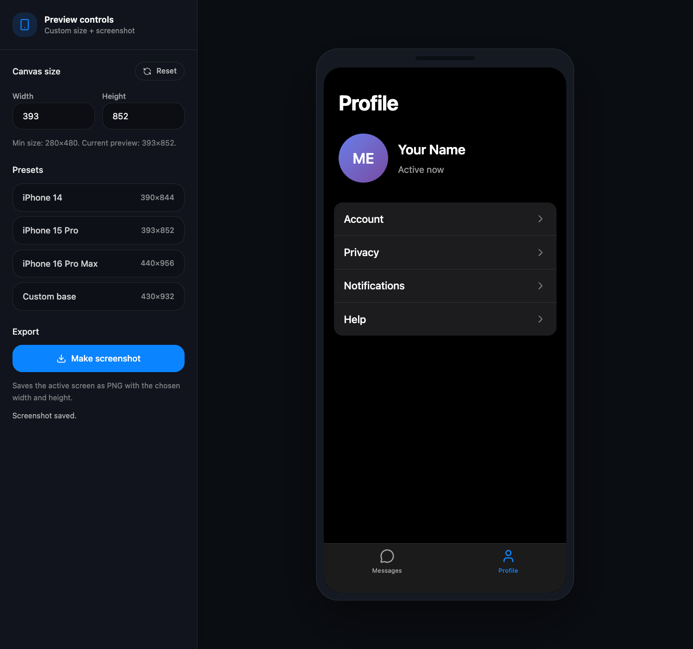

# TON Design System

<https://ton.org/en/brand-assets>

## TDS Wiki

[Home](https://github.com/systemdesigndao/ton-design-system/wiki)  
[Quick start](https://github.com/systemdesigndao/ton-design-system/wiki/Quick-start)  
[dotlottie](https://github.com/systemdesigndao/ton-design-system/wiki/dotlottie)  
[yanot-charts](https://github.com/systemdesigndao/ton-design-system/wiki/yanot-charts)  
[ton-connect](https://github.com/systemdesigndao/ton-design-system/wiki/TON-Connect)

## TDS Highlights

- Advantages of TailwindCSS

  TailwindCSS offers flexibility and scalability with its utility-first approach.  
  It allows for fast, customizable UI development without imposing design constraints.

- Awesome DX (Developer Experience)

  TailwindCSS improves developer experience by offering instant feedback, comprehensive documentation, and tools like `rsbuild` for optimized development workflows.

- Atomic CSS

  TailwindCSS automates the generation of atomic classes, where each class does one specific thing, ensuring small, reusable, and predictable CSS.

- Design Tokens

  Design tokens provide a system for values like colors, typography, and spacing.  
  The example includes the golden ratio for generating dynamic spacing, font sizes, and more, ensuring design consistency across the app.

- Lightweight

  TailwindCSS is lightweight, which offer a lean, production-ready solution for creating fast and optimized products.

- Ready to go patterns

  A folder (registry/patterns) with pre-built, customizable UI patterns, enabling quick prototyping and reusable components for rapid development.  
  Checkout [patterns](https://github.com/systemdesigndao/ton-design-system/tree/master/registry#patterns).

- CLI

  You can copy projects and components from the `registry` with the CLI. See [TDS Wiki Quick Start](https://github.com/systemdesigndao/ton-design-system/wiki/Quick-start).

- iOS Web shadcn

  Prototype right in Web using AI tools.

## More examples

- Examples of usages within [`ton-design-system/registry`](https://github.com/systemdesigndao/ton-design-system/blob/master/registry/README.md#contain)
- Example of usage with [`next-typescript`](https://github.com/designervoid/ton-design-system-next-typescript)
- Example of usage with [`rn-typescript`](https://github.com/designervoid/ton-design-system-rn-typescript)

### Raw

### iOS Web shadcn

[`ton-design-system/registry/ios-web-shadcn`](https://github.com/viperfoundation/ton-design-system/blob/master/registry/ios-web-shadcn)

## License

MIT
